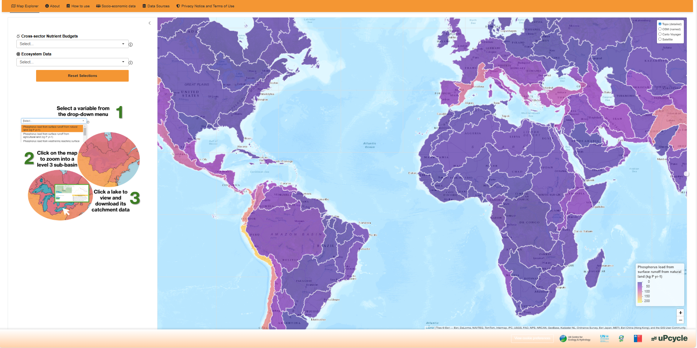
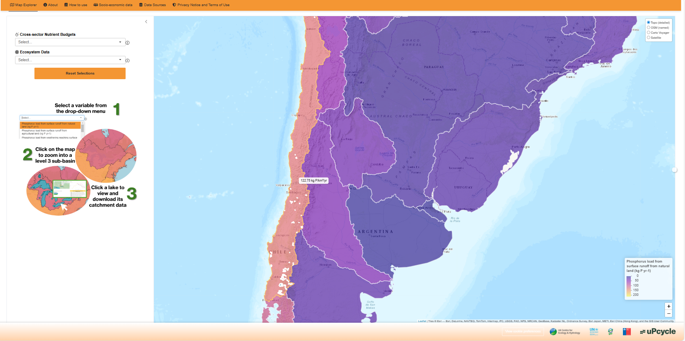
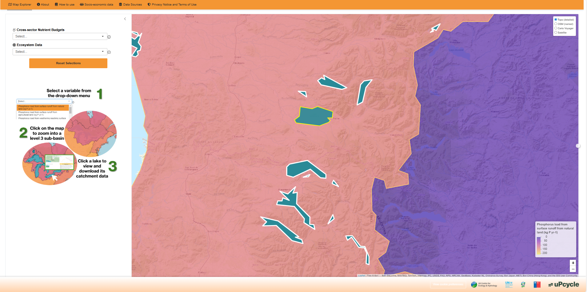
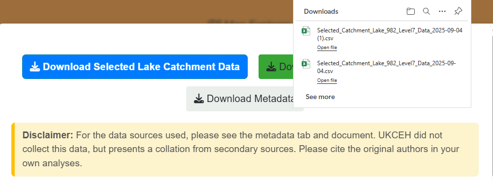

*Phosphorus and nitrogen are critical plant nutrients, essential for fertiliser production and global food security. However, poor management across the anthropogenic nutrient cycles leads to losses associated with pollution of water bodies, driving eutrophication, biodiversity loss, and methane emissions. Addressing these interconnected challenges requires a sustainable, integral, and where possible, circular approach across the entire nutrient cycle. However, data on phosphorus and nitrogen emissions and impacts are fragmented across sectors and lack standardisation. Here, we introduce a new open-access web-based application: the ‘Global Lakes Explorer’, which harmonises phosphorus and nitrogen emissions data alongside socio-economic and biodiversity risk factors spanning over 50 variables from multiple open data sources, covering more than 40,000 lake catchments worldwide. It enables users to visualise and download information on nutrient emissions across sectors, including agriculture, aquaculture, and wastewater, alongside socio-economic and environmental indicators. The app supports integrated governance on sustainable nutrient management in lake catchments by providing hindcasted emission data (1970-2015) in addition to future scenarios relating to shared socio-economic pathways (2015–2070) under various development projections.*

## User manual

### uPcycle: Our Mission

Our mission is to widen the scope and accelerate the development of phosphorus and nitrogen emissions reduction programmes globally.
There is international recognition of the need for an Emergency Recovery Plan for freshwater ecosystems, as highlighted at the UN Water Conference 2023.
Unsustainable nutrient management is a key driver of water pollution, biodiversity loss, and disruptions to food security. By fostering collaboration and open data sharing, we aim to ensure
that actionable solutions for sustainable nutrient management are accessible and equitable.

### The Nutrient Challenge

Phosphorus and nitrogen are essential components of fertilisers and critical for the global food system. However, the unsustainable management of these nutrients leads to their loss into
water bodies, driving eutrophication, biodiversity loss, and methane emissions, which exacerbate climate change. Addressing these interconnected challenges requires a circular approach to managing
phosphorus and nitrogen, optimising their use and recycling them to mitigate environmental impacts. Fragmented data on nutrient emissions and their socio-economic and environmental impacts has
hindered progress, and our dashboard seeks to address these gaps.

This dashboard provides an open-access platform harmonising phosphorus and nitrogen data spanning agriculture, aquaculture, wastewater, and other sectors. It incorporates
data on nutrient management, socio-economic factors, and biodiversity risk across over 40,000 lake catchments worldwide. By offering hindcasted emission data (1970-2015) and future scenarios (2015–2070)
aligned with shared socio-economic pathways, this tool supports evidence-based decision-making and targeted efforts to meet global sustainability targets like the UN SDGs and the Kunming-Montreal Global
Biodiversity Framework goals. Through integrated governance and informed action, we seek to address nutrient hotspots, mitigate risks, and advance sustainable development.

### About this Dashboard

This dashboard is part of the [uPcycle project](https://www.upcyclelakes.org/), and provides access to global data on nutrient use, socio-economic indicators, and environmental impacts related to phosphorus and nitrogen.
We have collected and harmonised open-access datasets covering various temporal and spatial resolutions and made them available for interactive exploration at the scale of hydrological basins, countries,
and individual lake catchments.

The goal is to provide stakeholders with a simple, transparent interface to better understand global nutrient flows and their implications for sustainability targets like the UN SDGs.
Users can explore data visually, filter by region or variable, and download information for further analysis.

## How to use the Global Lakes Explorer for your own lake catchments

This guide will walk you through the steps to use the Global Lakes Explorer effectively to explore and analyze data for a lake and its catchment. In this case, we use the example of Lake Villarica in Chile.

#### Step 1: Explore the Map Explorer view

The Global Lakes Explorer opens to a global map view showing nutrient emission and landscape variables. Use the variable drop-down menu to toggle between variables. Use the zoom and pan controls to find your region.

#### Step 2: Navigate to your basin

Click once on the basin of choice on the map. This loads lakes within that basin.

#### Step 3: Navigate to your lake
Hovering over a lake outlines it in yellow. Click to open detailed statistics for that lake and catchment.

#### Step 4: View lake catchment statistics
The pop-up displays various statistics like population density and land use. It also shows phosphorus and nitrogen emission projections under SSP scenarios.

#### Step 5: Download data for your lake catchment
Download the raw data via the 'Download Data' button. You get a CSV file with all data shown in plots. Metadata and data sources are in the 'Data Availability' tab.

#### Step 6: Analyse your downloaded data
Use a coding or analysis platform such as R, Python, or Excel to analyse downloaded data.

#### Step 7: Combine with ground-truthed data for your lake
Combine the downloaded data with local measurements to validate model projections and gain a better understanding of your lake’s health.

### Tutorial Video: Exploring the Global Lakes Explorer

https://www.youtube.com/watch?v=AOvDzx2miSk

Transcript

Welcome to the Global Lakes Explorer! This tool allows you to explore and download valuable data related to nutrient use, land use, and environmental variables for over 40,000 lake catchments worldwide.

To get started, select a variable from the drop-down menu. This will display the data on the map. You can also view the projected data for a specific year or for a shared socioeconomic pathway.

Click anywhere on the map to zoom in a specific HydroBasin. This will display the Lakes within. Once zoomed in click on the lake to generate a statistics card. This card will show you the visualizations of data about the lake and its catchment including relevant nutrient statistics. Download a CSV file for your selected lake catchment.

Visit the socioeconomic tab to view and download relevant socioeconomic data at a national resolution. To view the data sources behind the global lakes explorer, head to the data sources tab.

You're now ready to download lake catchment data and conduct your own analyses.

Thank you for watching, and happy exploring!

## Repository navigation

Top-level directories and key files:

- `R/`: application code (ui, server, module tabs)
- `inst/`: installed app assets/resources 
- `data/`: packaged data files used by the app
- `data-raw/`: data preparation notes/scripts
- `renv/`: renv bootstrap and settings
- `man/`: documentation 

## Required packages

Core runtime dependencies:

- bsicons
- bslib
- config (>= 0.3.2)
- dplyr
- fmsb
- ggplot2
- golem (>= 0.4.1)
- grDevices
- htmlwidgets
- leafgl
- leaflet
- lorem
- magrittr
- sf
- shiny (>= 1.8.1.1)
- shinyjqui
- shinyjs
- shinyWidgets
- tidyr
- viridis

Other packages used in the codebase:

- tidygeocoder
- viridisLite
- stringr
- plotly
- purrr
- scales

Development / deployment helpers:

- attachment
- covrpage
- desc
- devtools
- httpuv
- pkgload
- rhub
- rsconnect
- rstudioapi
- renv
- testthat
- usethis
